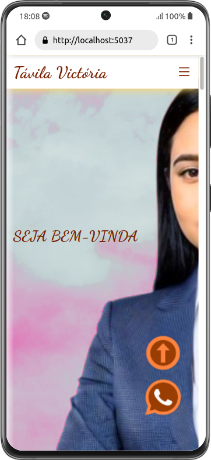

<div align="center">
  
  
</div>

## Tópicos

<div>
 • <a href="#-sobre-o-projeto">Sobre o Projeto</a> </br>
 • <a href="#-tecnologias">Tecnologias</a> </br>
 • <a href="#-layout">Layout</a> </br>
 • <a href="#-funcionalidades">Funcionalidades</a> </br>
 • <a href="#-estrutura-de-pastas">Estrutura de pastas</a> </br>
 • <a href="#-como-executar-o-projeto">Como executar</a> </br>
 • <a href="#-como-contribuir">Como contribuir</a> </br>
</div>

## Sobre o projeto

Este projeto é destinado ao desenvolvimento de um sistema particular de gerenciamento de serviços e produdos prestados a um estabelecimento de carater estetico..

## Tecnologias

#### **Website** ( [.NET](https://dotnet.microsoft.com/pt-br/learn/dotnet/what-is-dotnet))

- [Html](https://developer.mozilla.org/pt-BR/docs/Web/HTML)
- [Javascript](https://developer.mozilla.org/pt-BR/docs/Web/JavaScript)
- [Css](https://developer.mozilla.org/pt-BR/docs/Web/CSS)
- [C#](https://dotnet.microsoft.com/pt-br/languages/csharp)

#### **API e Framework**

- [Whatsapp](https://business.whatsapp.com/developers/developer-hub?lang=pt_BR)
- [Entity](https://learn.microsoft.com/en-us/ef/)

#### **Utilitários**

- Banco de dados: **[SQL Server](https://www.microsoft.com/pt-br/sql-server)**
- Editor: 
  - **[Visual Studio Community](https://visualstudio.microsoft.com/pt-br/vs/community/)**
  - **[Visual Studio Code](https://code.visualstudio.com/)** → Extensions: **[C# Dev Kit](https://code.visualstudio.com/docs/csharp/get-started)** + **[C# Extensions](https://github.com/kreativjos/csharpextensions)**
- Fontes: **[Roboto](https://fonts.google.com/specimen/Roboto)** + **[Dancing Script](https://fonts.google.com/specimen/Dancing+Script)** 
- Versionamento: **[Git](https://git-scm.com)**

## Layout

<div align="center">
<video width="640" height="380" controls autoplay loop>
  <source src="./SGU/wwwroot/video/Layout.webm" type="video/webm">
</video>
<video width="240" height="480" controls autoplay loop>
  <source src="./SGU/wwwroot/video/mobile-layout.webm" type="video/webm">
</video>
</div>

## Funcionalidades

Features que estão sendo adicionadas na aplicação

**Front-end Web**

- [X] Top button (voltar usuario ao inicio)
- [X] Ingração com Whatsapp
- [ ] Email para contato (Envio de email)
- [ ] Como chegar (direcionar para gps)

**Front-end Mobile**

- [x] Menu tropdown

**Back-end**

- [x] Cadastro e login de usuarios
- [ ] Agendamento de atendimento
- [ ] Realização de comentarios por parte dos usuarios
- [ ] Recuperação de senha 
- [ ] Autenticação via facebook e google
- [ ] Gerencimento de servições por parte do administrador

## 🛠 Estrutura de pastas

Afim de facilitar a organização e manutenção do código, foi definido um padrão para organização das pastas neste projeto.

**Front-end Web**

- **/Views**: Arquivos Html de cada pagina
  - **/Home**: Html pagina Home
  - **/Shared**: Html global de todas as paginas.
  - **/Usuario**: Todas as paginas interativas dos usuario
- **/wwwroot**: Contem a organização dos assets front-end.
  - **/css**: Estilos das paginas disponibilizadas na pasta back-end **Views**
    - **/Home**: Devido seu nivel de detalhamento foi separa um diretorio proprio para a home page
    - **/Usuario**: Estilos de todas as paginas de interação do usurio.
  - **/img**: Todas as imagens encontradas no projeto
    - **/gallery**: Destinada as imagens que farão parte da galeria na Home page
    - **/icons**: Icones tulizando em todo o website
    - **/servicos**: Imagem de serviços encontrados na aplicação
  - **/js**: Scripts javascript destinado a cada pagina
  - **/lib**: Todas as bibliotecas locais utilizadas, assim evitando intabilidade de servidores terceiros
  - **/video**: Todo material de video local.


**Back-end**

- **/ConfSistema**: Pasta para configurações globais
- **/Controllers**: Reponsavel por direcionar todas as requisições de entrada e saida
- **/Models**: Destinada a todos os modelos de tabelas do banco de dados
- **/ORM**: Mapeamento do banco de dados
- **/Properties**: Configurações gerais de chamdas do sistema


## Como executar o projeto

### Pré-requisitos

Antes de começar, você vai precisar ter instalado em sua máquina as seguintes ferramentas: 
- [Git](https://git-scm.com);
- [.NET 7 ou superior](https://dotnet.microsoft.com/pt-br/learn/dotnet/what-is-dotnet);
- [Github Desktop](https://desktop.github.com/)

Além disto é bom ter um editor para trabalhar com o código como:

  - **[Visual Studio Community](https://visualstudio.microsoft.com/pt-br/vs/community/)**
  - **[Visual Studio Code](https://code.visualstudio.com/)** → Extensions: **[C# Dev Kit](https://code.visualstudio.com/docs/csharp/get-started)** + **[C# Extensions](https://github.com/kreativjos/csharpextensions)**

Para executar o banco de dados , foi utilizado a aplicação do **[SQL Server](https://www.microsoft.com/pt-br/sql-server)**, mas existem outras alternativas como o [Docker container](https://www.docker.com/resources/what-container/)

#### 🎲 Rodando a aplicação

- Clone este repositorio usando o [Github Desktop](https://desktop.github.com/)

- link para clonagem do repositorio 
  ```bash
    https://github.com/Lucianolpsf/SGU.git
  ```
- Vá para a pasta da aplicação
- abra com sua IDE escolhida e execute o arquivo program.cs

---

# Como contribuir

Caso queira contribuir, seja corrigindo bugs, adicionando comentários ou novas features, você pode seguir o seguinte tutorial:

- Faça um **[fork](https://help.github.com/pt/github/getting-started-with-github/fork-a-repo)** desse repositório
- **[Clone](https://help.github.com/pt/github/creating-cloning-and-archiving-repositories/cloning-a-repository)** o repositório que você fez o fork em seu computador
- Crie uma branch com a sua feature: `git checkout -b minha-alteracao`
- Envie suas alterações para a _staging area_: `git add .`
- Faça um commit contando o que você fez: `git commit -m "feat: minha nova alteracao!"`
- Faça um push para a sua branch: `git push origin minha-alteracao`
- Agora é só abrir uma _pull request!_ para nossa branch **DEV** de desenvolvimento

_Caso tenha alguma dúvida, confira este [guia de como contribuir no GitHub](https://github.com/firstcontributions/first-contributions/blob/master/translations/README.pt_br.md) :)_


